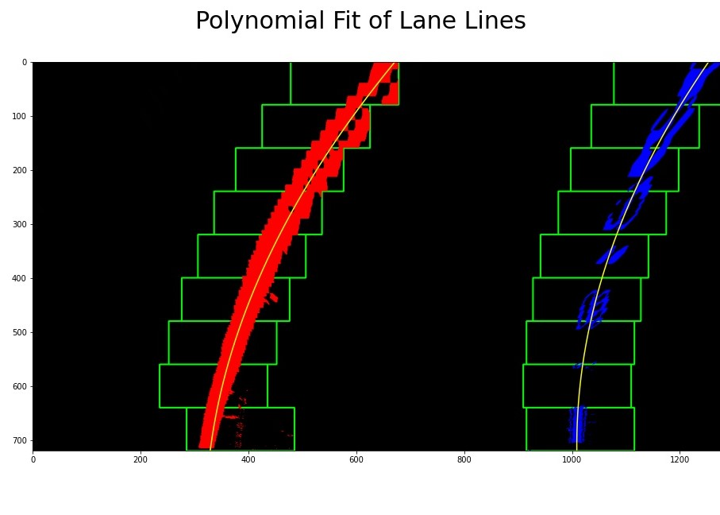

# Advanced Lane Finding
This software pipeline identifies the lane boundaries in a video from a front-facing camera on a car. The algorithm applies computer vision techniques to analyze images: camera calibration, distortion correction, binary thresholding, perspective transformation, and polynomial fitting.

## Overview

The steps of this project are the following:

* Compute the camera calibration matrix and distortion coefficients given a set of chessboard images.
* Apply a distortion correction to raw images.
* Use color transforms, gradients, etc., to create a thresholded binary image.
* Apply a perspective transform to rectify binary image ("birds-eye view").
* Detect lane pixels and fit to find the lane boundary.
* Determine the curvature of the lane and vehicle position with respect to center.
* Warp the detected lane boundaries back onto the original image.
* Output visual display of the lane boundaries and numerical estimation of lane curvature and vehicle position.

## Camera Calibration

The code of this step is contained in the second and third cell of the IPython notebook.

I start by preparing "object points", which will be the (x, y, z) coordinates of the chessboard corners in the world. Here I am assuming the chessboard is fixed on the (x, y) plane at z=0, such that the object points are the same for each calibration image.  Thus, `objp` is just a replicated array of coordinates, and `objpoints` will be appended with a copy of it every time I successfully detect all chessboard corners in a test image.  `imgpoints` will be appended with the (x, y) pixel position of each of the corners in the image plane with each successful chessboard detection.  

I then used the output `objpoints` and `imgpoints` to compute the camera calibration and distortion coefficients using the `cv2.calibrateCamera()` function.  I applied this distortion correction to the test image using the `cv2.undistort()` function and obtained this result:


I saved the camera calibration and distortion coefficients in a pickle file located in "./wide_dist_pickle.p".

## Pipeline

### Distortion Correction

Here is an example of distortion correction in one of the test images. 

I start by reading the camera calibration and distortion coefficients from a pickle file. I then applied this distortion correction to the test image using the `cv2.undistort()` function and obtained this result:


### Thresholding

The next step in the pipeline is to generate a thresholded binary image. This image provides a clear visualization of the lane boundaries.

I used a combination of color and gradient thresholds to generate a binary image. Here is an example of my output for this step:


### Perspective Transform

The next step in the pipeline is to transform the perspective of the image as seen from above. I defined source points and destination points to calculate the matrices that would change the perspective.

We need two matrices one to transform the perspective and the other to undo the transformation.

This section of code shows the definition of the source and destination points.

```python
# Four source coordinates
src = np.array([[205, 720], 
                [600, 445], 
                [685, 445], 
                [1105, 720]], dtype=np.float32)

# Reduce the width of the image by offset to form a rectangle
offset = 300

# Four destination coordinates
dst = np.array([[offset, img.shape[0]], 
                [offset, 0], 
                [img.shape[1] - offset, 0], 
                [img.shape[1] - offset, img.shape[0]]], dtype=np.float32)
```

I verified that my perspective transform was working as expected by drawing the `src` and `dst` points onto a test image and its warped counterpart to verify that the lines appear parallel in the warped image.


### Lane Boundaries Identification

I used a sliding windows algorithm to determine the pixels corresponding to the left and right lane lines. I first took the histogram of the bottom half of the image to find the starting point of the left and right lines. Then I defined windows around the starting point to search for other pixels corresponding to the line. 

### Polynomial Fitting

I then used the pixels from each line to fit a second order polynomial that characterizes the left and right lines. 

This two steps are shown in the following image:



### Radius of Curvature

This section is contained in cell #19 of the **Jupyter Notebook**: `advanced_lane_finding.ipynb`.

In the previous section, I identified which pixels belong to the left and right lines (shown in red and blue, respectively). We can calculate the radius of curvature of the polynomial fit by applying the following equation:

| Description         | Equation                                                     |
| ------------------- | ------------------------------------------------------------ |
| Polynomial Curve    |  |
| Radius of Curvature |  |

I first define the conversion of (x, y) from pixel space to real-world space.

```python
    # Define conversions in x and y from pixels space to meters
    ym_per_pix = 30/720 # meters per pixel in y dimension
    xm_per_pix = 3.7/700 # meters per pixel in x dimension
```

I then evaluate the formula at the bottom of the image because that is the closest radius of curvature to the vehicle.

```python
    # Fit a second order polynomial to real world positions in each lane lines
    left_fit_cr = np.polyfit(ploty*ym_per_pix, leftx*xm_per_pix, 2)
    right_fit_cr = np.polyfit(ploty*ym_per_pix, rightx*xm_per_pix, 2)
    
    # Define y-value where we want radius of curvature
    # We'll choose the maximum y-value, corresponding to the bottom of the image
    y_eval = np.max(ploty)
    
    # Implement the calculation of radius of curvature
    left_curverad = ((1 + (2*left_fit_cr[0]*y_eval*ym_per_pix + left_fit_cr[1])**2)**1.5) / np.abs(2*left_fit_cr[0])
    right_curverad = ((1 + (2*right_fit_cr[0]*y_eval*ym_per_pix + right_fit_cr[1])**2)**1.5) / np.abs(2*right_fit_cr[0])
```

### Vehicle Position

To calculate the vehicle position with respect to the center, I first found the pixel that represent the center of the lane. I then subtracted the center of the image, and converted to real word dimensions.

### Lane Area Projection

I used the location of the line pixels to generate the lane area. I also added the information about the curvature and vehicle position to the image.

Here is an example of my output:


## Video Output

Here is a [link to my video result](./project_video_output.mp4).